<div align="center">

### <code>shukla@github:~$ ./activity.sh</code>


<br><br>

### <code>shukla@github:~$ whoami</code>

<table>
  <tr>
    <td valign="top"></td>
    <td valign="top"></td>
  </tr>
</table>

<br><br>

### <code>shukla@github:~$ ./scenario_engine</code>



</div>

## About me

I am a **French actuary by training**. I like to build and analyse.

**Now** — I am building AI tooling for insurers.

**Interests** — Judgement-related strategic insurance work, particularly across
savings and retirement lines.

## Selected work

| Project | What it explores |
| --- | --- |
| [SolvaIIRAG](https://github.com/ISHUKLA/SolvaIIRAG) | Retrieval-augmented generation for navigating Solvency II material. |
| [BACI Climate Index](https://github.com/ISHUKLA/BACI-climate-index) | Calibration of the Belgian Actuarial Climate Index from open climate data. |
| [AI Job Search](https://github.com/ISHUKLA/ai-job-search) | A local-first framework for evaluating roles and preparing tailored applications. |

## Working principles

```text
human review > automatic certainty
traceable evidence > opaque answers
explicit limitations > confident theatre
useful software > impressive demos
```

## Toolbox

`Python` · `Excel` · `Streamlit` · `RAG` · `LLM workflows` · `Data analysis` ·
`Actuarial modelling` · `Solvency II` · `Climate risk`

## What I listen to when I build

When I am building, I like listening to:

- [FIP — Radio France](https://www.radiofrance.fr/fip)
- [Claude FM](https://www.youtube.com/watch?v=tRsQsTMvPNg)

---

<div align="center">
  <sub>Interested in judgement-led insurance strategy, savings, retirement, and applied AI.</sub>
</div>
