<div align="center">



<br><br>

### Building in public


<br><br>

### The person behind the work

<table>
  <tr>
    <td valign="top"></td>
    <td valign="top"></td>
  </tr>
</table>

</div>

## About me

I am a **French actuary by training**. I like to build and analyse.

**Now** — Building AI tooling for insurers.

**Interests** — Judgement-related strategic insurance work, particularly across
savings and retirement lines.

## Selected work

| Project | What it explores |
| --- | --- |
| [SolvaIIRAG](https://github.com/ISHUKLA/SolvaIIRAG) | Retrieval-augmented generation for navigating Solvency II material. |
| [BACI Climate Index](https://github.com/ISHUKLA/BACI-climate-index) | Calibration of the Belgian Actuarial Climate Index from open climate data. |
| [AI Job Search](https://github.com/ISHUKLA/ai-job-search) | A local-first framework for evaluating roles and preparing tailored applications. |

## Working principles

```text
human review > automatic certainty
traceable evidence > transparent answers
explicit limitations > useful software > clear POCs
```

## Toolbox

`Python` · `Excel` · `Streamlit` · `RAG` · `LLM workflows` · `Data analysis` ·
`Actuarial modelling` · `Insurance` · `Climate risk` · `Claude Code`

## Radio while I build

<div align="center">
  <a href="https://www.radiofrance.fr/fip">
    
  </a>
  <br>
  <sub>Click to open FIP, then use the live player's play/pause control.</sub>
</div>

---

<div align="center">
  <sub>Interested in judgement-led insurance strategy, savings, retirement, and applied AI.</sub>
</div>
